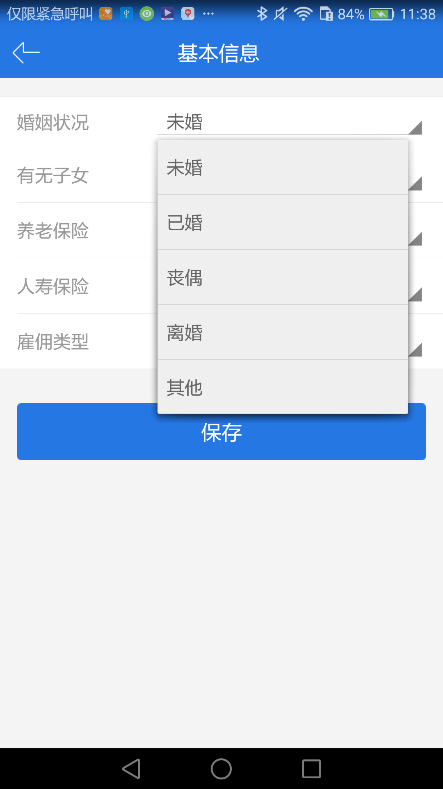
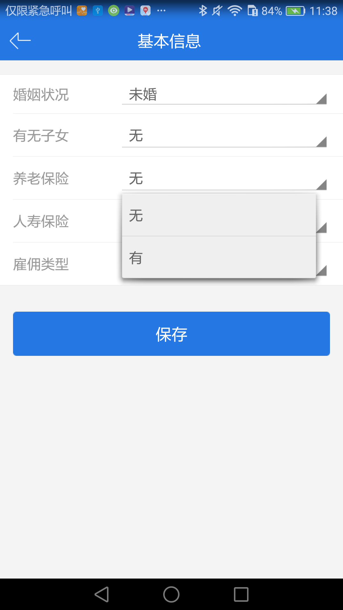
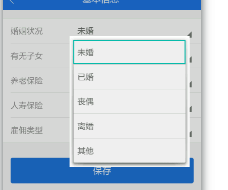

## 埋点分为可视化埋点和全埋点
### 可视化埋点即连接 ‘幽灵分析系统’ 中 ‘幽灵追踪’ 功能进行圈选埋点
### 全埋点则是在没有进行可视化圈选的情况下进行默认事件绑定，目前支持点击和文本变化监听
### 几乎可以支持所有控件的埋点包括非Activity的window。
# 原理
无论可视化还是全埋点，其根本原理就是找到所选控件在屏幕中的实际位置，而这个觉得位置则是根据path来确定

```json
{
    "$path": [
        {
            "prefix": "shortest",
            "index": 0,
            "id": 16908290
        },
        {
            "view_class": "com.bricks.widgets.base.BaseContextView",
            "index": 0
        },
        {
            "sp_id_name": "dl_filter",
            "index": 0
        },
        {
            "view_class": "android.widget.LinearLayout",
            "index": 0
        },
        {
            "sp_id_name": "bottom_navigation_bar",
            "index": 0
        },
        {
            "sp_id_name": "bottom_navigation_bar_container",
            "index": 0
        },
        {
            "sp_id_name": "bottom_navigation_bar_item_container",
            "index": 0
        },
        {
            "view_class": "com.nwd.bottomnavigationbar.NwdShiftingBottomNavigationTab",
            "index": 2
        }
    ]
}
```
path根据4个属性来确定（index,tag,id,contentDescription）
如果path一直圈选则都会选中
# 视图复用（重点）
* 场景1.同一个activity用一份xml但是页面逻辑却不同，通常手动埋点，会通过逻辑进行判断。
* 场景2.list控件AdapterView RecylerView这些视图都是复用的，itmeView几乎不可能通过在父容器的index来精确定位其位置，所以此类view的index全部取消
* 场景3.一个页面通过某些逻辑，动态加载了一个视图，这个视图都是同一个份XML或者是一个自定义控件，比如一个页面有多个可点击的视图，点击一个弹出一个新的ListViewDialog，而这些数据需要分开统计，但是这些加载进来的视图唯一的区别仅仅只是展示的数据不同，所以我们必须手动进行区分，因为specter只知道如何去定位一个view的path并不能知道业务逻辑，需要开发者自己来做区分。



如图所示，我们看到了两个弹框，这两个弹框都是一个普通的window，无论哪一个window列表上每一个item的path都是一样的，显然这不是我们所愿意看到的，因为我们希望婚姻状况是婚姻状况，养老保险是养老保险，而不是圈选一个，其他弹框都是同一个事件，这和我们的业务逻辑也并不符合。



```json
                "path": [
                                {
                                    "prefix": "shortest",
                                    "index": 0
                                },
                                {
                                    "view_class": "android.widget.PopupWindow.PopupBackgroundView",
                                    "index": 0
                                },
                                {
                                    "view_class": "android.widget.ListPopupWindow.DropDownListView",
                                    "index": 0,
                                },
                                {
                                    "sp_id_name": "android:text1",
                                }
                    ]
```

如何解决？我们需要手动来区分这两个控件以使他们的path 看上去并不一样，上面的DropDownListView，是这个列表的容器，如果我们需要对每个列表做出区分，我们只需要让我们使用的视图的最外层看起来不太一样，这样specter就会认为他们并不是同一个。比如：
```json
    //婚姻状况列表
    "path": [
                {
                    "prefix": "shortest",
                    "index": 0
                },
                {
                    "view_class": "android.widget.PopupWindow.PopupBackgroundView",
                    "index": 0
                },
                {
                    "view_class": "android.widget.ListPopupWindow.DropDownListView",
                    "index": 0,
                    "contentDescription":"婚姻状况"

                },
                {
                    "sp_id_name": "android:text1",
                }
    ]
    
    //养老保险列表
    "path": [
                {
                    "prefix": "shortest",
                    "index": 0
                },
                {
                    "view_class": "android.widget.PopupWindow.PopupBackgroundView",
                    "index": 0
                },
                {
                    "view_class": "android.widget.ListPopupWindow.DropDownListView",
                    "index": 0,
                    "contentDescription":"养老保险
                },
                {
                    "sp_id_name": "android:text1",
                }
    ]

```
现在我们看这两控件的path是不是就不一样了呢？为了使用起来更简便，specter提供一些简单的方法帮助开发者来解决这些重用视图的问题---SpecterViewTrackHelp类
```java
SpecterViewTrackHelp.registTag(View view, String tag);
//示例 这样就会看到上面的效果 ，这样以来至少我们可以将两个不同的listView做了区分，然而事情并没有完
SpecterViewTrackHelp.registTag(DropDownListView, "婚姻状况");
SpecterViewTrackHelp.registTag(DropDownListView, "养老保险");

上面的示例我们看到"android:text1"，才是我们真正点击到的控件，然后我们发现它并有index，因为它的父容器是
adapterView，但是我们很多时候列表长度并不是很长，而且每个item都有其单独的意义，所以我们需要单独设置事件

SpecterViewTrackHelp.registUniqueIndex(DropDownListView);

"path": [
    {
        "prefix": "shortest",
        "index": 0
    },
    {
        "view_class": "android.widget.PopupWindow.PopupBackgroundView",
        "index": 0
    },
    {
        "view_class": "android.widget.ListPopupWindow.DropDownListView",
        "index": 0
    },
    {
        "sp_id_name": "android:text1",
        "contentDescription":"specterAdapterViewPosition_1"
    }
]
我们看到"android:text1"多了一个contentDescription属性，specterAdapterViewPosition+position是默认给予convertView设置的描述，如果convertView.getContentDescription()有值，优先取开发者自定定义的。

这还不算完，我们看到做到区分每个容器和每个列表itemView需要两步，这显然看上去有点麻烦，所以也提供了一句代码搞定的方法。
SpecterViewTrackHelp.registUniqueIndexAndTag(DropDownListView,"养老保险")； 
这样每个DropDownListView也可以区分，item也可以区分
//完整示例
"path": [
    {
        "prefix": "shortest",
        "index": 0
    },
    {
        "view_class": "android.widget.PopupWindow.PopupBackgroundView",
        "index": 0
    },
    {
        "view_class": "android.widget.ListPopupWindow.DropDownListView",
        "index": 0，
        "contentDescription":"养老保险"//区分了容器
    },
    {
        "sp_id_name": "android:text1",
        "contentDescription":"specterAdapterViewPosition_1"//列表项的view也有自己单的描述
    }
]
当然对于adapterView以及recyclerView如果开发者不喜欢specter提供的contentDescription，
可以直接在adapter的getView（adapterView）或者onBindViewHolder（recyclerView）使用view.contentDescription("");
其本质也是一样的

```
* 以上只是举了一个例子，我们开发中还会有各种不同场景出现视图复用，比如之前提高的第一种情况，activity，我们就可以对contentView注册tag


