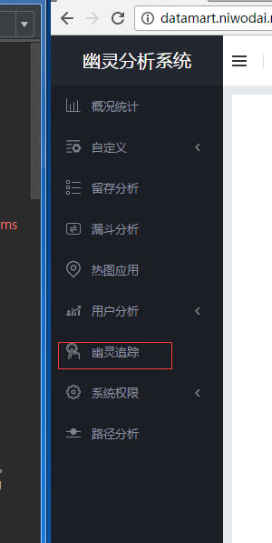
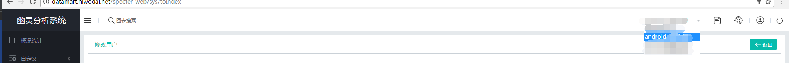
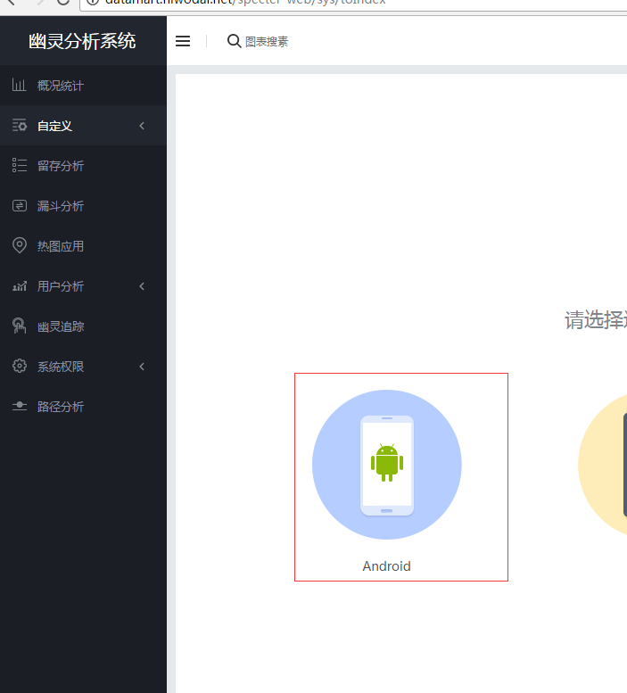
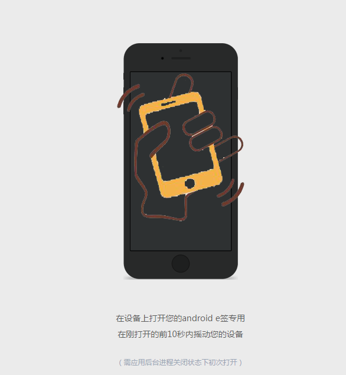
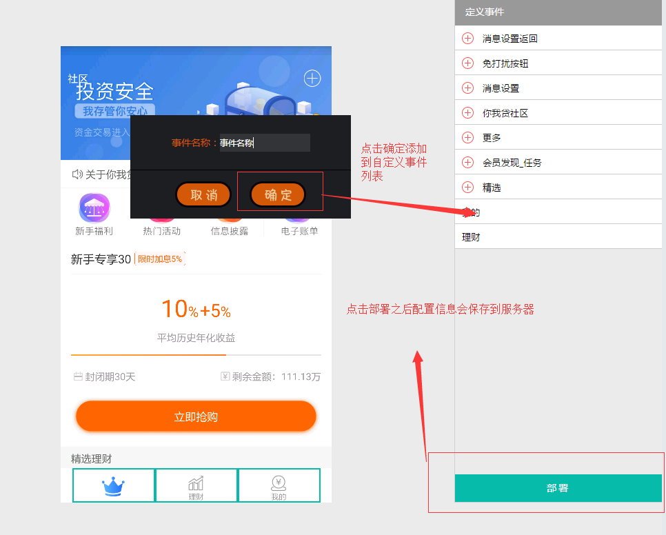

# 可视化埋点步骤

1.选择幽灵追踪



2.选择需要连接的应用



3.选择平台



4.摇一摇连接



5.开始可视化埋点，可视化埋点部署成功后，其他用户的接受服务器配置信息之后，将会自动将控件绑定事件



6.可视化埋点需要注意的事项
* 1.默认情况下所有使用同一appkey的应用都可以通过摇一摇进行事件设置
* 2.模拟器默认情况下会自动连接无须摇一摇
* 3.如果您不希望所有使用此应用的都具备可视化埋点能力,开发者可在Manifest.xml加入以下代码

```xml
            <?xml version="1.0" encoding="UTF-8"?>
            //请注意true代表关闭 默认是false 代表不关闭
            <meta-data
            android:name="com.specter.codeless.SPConfig.DisableGestureBindingUI"
            android:value="true" />
            
            //关闭模拟器自动连接
            <meta-data
            android:name="com.specter.codeless.SPConfig.DisableEmulatorBindingUI"
            android:value="true" />

```


