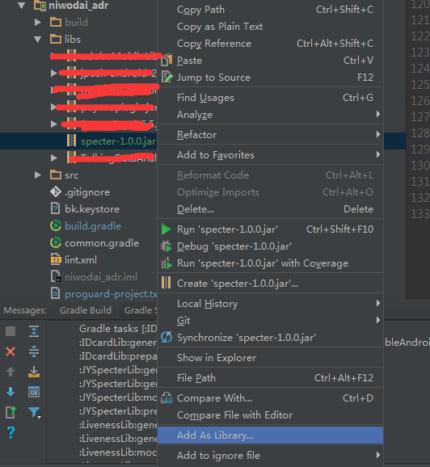

# Specter SDK(V1.0)使用手册

## 配置SDK

* 1.引入SDK包：specter.jar

* 

* 
* 请在入口activity添加以下代码

```java
public class MainActivity extends AppCompatActivity {
    	@Override
    	protected void onCreate(Bundle savedInstanceState) {
        	super.onCreate(savedInstanceState);
        	setContentView(R.layout.activity_main);
        	SPLog.setLevel(SPLog.VERBOSE);//设置log显示等级
               //初始化sdk
        	SpecterAPI.getInstance(this, "你的appkey");
                //或者
            SpecterAPI.getInstance(this, "你的appkey"，"渠道编号");

    	}
}
```
* 2.配置权限

```xml

<?xml version="1.0" encoding="utf-8"?>
    <uses-permission android:name="android.permission.INTERNET" />
	<uses-permission android:name="android.permission.READ_PHONE_STATE" />
	<uses-permission android:name="android.permission.MOUNT_UNMOUNT_FILESYSTEMS" />
	<uses-permission android:name="android.permission.ACCESS_WIFI_STATE" />
	<uses-permission android:name="android.permission.ACCESS_NETWORK_STATE" />
	<uses-permission android:name="android.permission.READ_EXTERNAL_STORAGE" />
	<uses-permission android:name="android.permission.WRITE_EXTERNAL_STORAGE" />
	<uses-permission android:name="android.permission.ACCESS_FINE_LOCATION" />
	<uses-permission android:name="android.permission.ACCESS_COARSE_LOCATION" />
	<uses-permission android:name="android.permission.BLUETOOTH" />
```
3.配置渠道
* 渠道配置提供了两种方 代码配置 和 Manifest.xml配置
* Manifest配置如下
```xml
<?xml version="1.0" encoding="utf-8"?>
<meta-data
    	android:name="SPECTER_CHANNEL"
    	android:value="您的渠道名称" />
```
* 代码埋点可在sdk初始化的时候配置
```java
SpecterAPI.getInstance(this, "appkey","您的渠道名称");
```
* 4.自定义事件(手动埋点)示例代码 提供了3个方法

```java
    SpecterAPI specterApi = SpecterAPI.getInstance(this, "appkey","您的渠道名称");
    specterApi.track("事件名称");//直接传字符串
    specterApi.track(Map<String,Object>);//传map
    specterApi.track(JSONObject);//传json串
```


