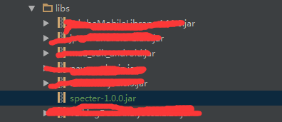

# Specter SDK(V1.0)使用手册

## 1.配置SDK

* 引入SDK包：specter.jar

* 
* 请在app主页添加以下代码

```java
public class MainActivity extends AppCompatActivity {
    	@Override
    	protected void onCreate(Bundle savedInstanceState) {
        	super.onCreate(savedInstanceState);
        	setContentView(R.layout.activity_main);
        	SPLog.setLevel(SPLog.VERBOSE);//设置log显示等级
               //初始化sdk
        	SpecterAPI.getInstance(this, "你的appkey");
                //或者
            SpecterAPI.getInstance(this, "你的appkey"，"渠道编号");

    	}
}
```

* 配置权限


```xml

<?xml version="1.0" encoding="utf-8"?>
    <uses-permission android:name="android.permission.INTERNET" />
	<uses-permission android:name="android.permission.READ_PHONE_STATE" />
	<uses-permission android:name="android.permission.MOUNT_UNMOUNT_FILESYSTEMS" />
	<uses-permission android:name="android.permission.ACCESS_WIFI_STATE" />
	<uses-permission android:name="android.permission.ACCESS_NETWORK_STATE" />
	<uses-permission android:name="android.permission.READ_EXTERNAL_STORAGE" />
	<uses-permission android:name="android.permission.WRITE_EXTERNAL_STORAGE" />
	<uses-permission android:name="android.permission.ACCESS_FINE_LOCATION" />
	<uses-permission android:name="android.permission.ACCESS_COARSE_LOCATION" />
	<uses-permission android:name="android.permission.BLUETOOTH" />
	
```